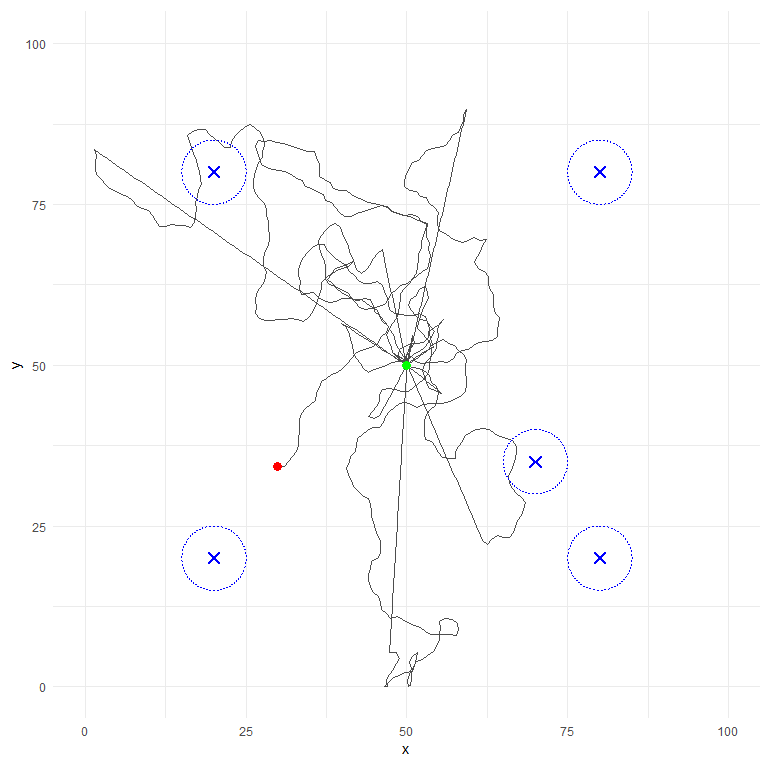

# Central Place Foraging & Camera Trap Simulation
James Owens

# Project Overview

This repository contains a stochastic simulation model of a **Central
Place Forager (CPF)** moving through a resource-scattered environment.
The agent’s movements are monitored by a network of **Camera Traps**
that utilize probabilistic, distance-dependent detection logic.

Theis model will act as a baseline for future development in analysing
the effectiveness of current geographic profiling (GP) techniques in
predicting nesting/breeding sites of a CPF against variable and often
human-dominated landscapes.

# Methodology

## 1. Movement Model

The agent utilizes a **Correlated Random Walk (CRW)**. Unlike a pure
Brownian walk, the agent retains a “memory” of its previous heading
(Inertia), resulting in biologically realistic, semi-directional paths.

- **Foraging State:** High randomness, seeking resources.
- **Returning State:** Ballistic movement vector towards the Nest
  coordinates.

## 2. Detection Model

Detection is not a binary “In/Out” radius check. We model detection
probability ($P$) using a **Reverse Sigmoid Function**:

$$P(d) = P_{max} \times \frac{1}{1 + e^{k \cdot (d - d_{inf})}}$$

Where:

- $P_{max}$: Maximum probability at distance 0 (the camera lens).
- $d$: Current distance to camera.
- $d_{inf}$: Inflection point (distance where $P$ drops to 50%).
- $k$: Steepness of the decay curve.

# Simulation Run

``` r
# 1. Define Camera Locations
camera_setup <- data.frame(
  x = c(20, 70, 80, 20, 80),
  y = c(20, 35, 20, 80, 80)
)

# 2. Run the Simulation
# Note: create_gif = TRUE will generate the animation file
sim_output <- run_simulation(
  sim_name = "README_Example_Run",
  steps = 100,
  seed = 404,          # Fixed seed for reproducibility
  nest_coords = c(50,50),
  inertia = 0.7,       # High inertia = smoother path
  camera_coords = camera_setup,
  radius = 5,         # Detection max radius
  p_detection_max = 0.85,
  cooldown = 30,       # Cameras wait 30 steps between photos
  create_gif = TRUE
)
```

# Results

## Performance Metadata

The simulation completed successfully.

- **Duration:** 0.2137 seconds
- **Total Steps:** 100
- **Seed:** 404

## Detection Statistics

The table below summarizes how many times each camera successfully
triggered.

``` r
if(!is.null(sim_output$detections)) {
  
  # Summarize detections by Camera ID
  stats <- sim_output$detections %>%
    group_by(camera_id) %>%
    summarise(
      Total_Hits = n(),
      First_Sighting = min(step),
      Last_Sighting = max(step)
    )
  
  # Display pretty table
  kable(stats, caption = "Camera Trap Capture Log")
  
} else {
  print("No detections were recorded in this run.")
}
```

| camera_id | Total_Hits | First_Sighting | Last_Sighting |
|----------:|-----------:|---------------:|--------------:|
|         2 |          1 |             82 |            82 |

Camera Trap Capture Log

# Visualization

## Static Trajectory

The grey path represents the CPFs movement behavior while the blue
circles represent the camera detection zones. The green point is the
central place (nest/breeding site) and the red point is the final step
in the simulation.

``` r
# Display the ggplot object returned by the simulation
sim_output$plot
```



## Temporal Animation

- **Animation Render Time:** 11.773 seconds

The animation below visualizes the agent’s path in real-time. The
counter in the top-left tracks the cumulative detections across the
network.

This animation feature is FALSE by default to prevent lengthy animation
times for high step count simulations.

*(Note: The detection logic includes a ‘Cooldown’ period, preventing the
counter from skyrocketing, with the model detecting the CPF at every
step as it passes through the camera radius.)*


